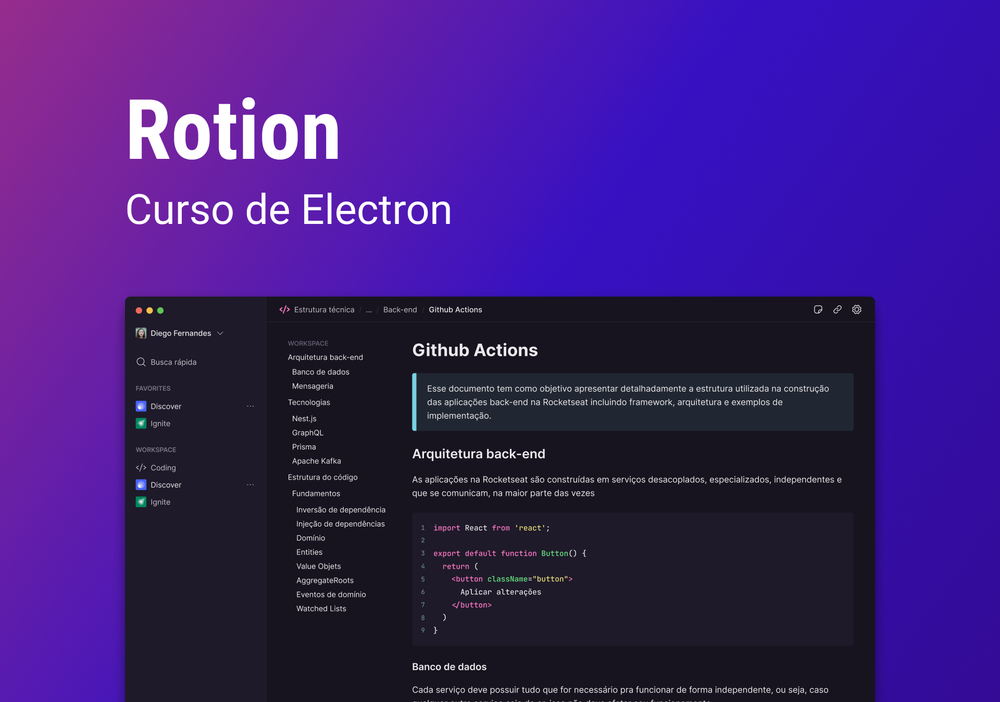
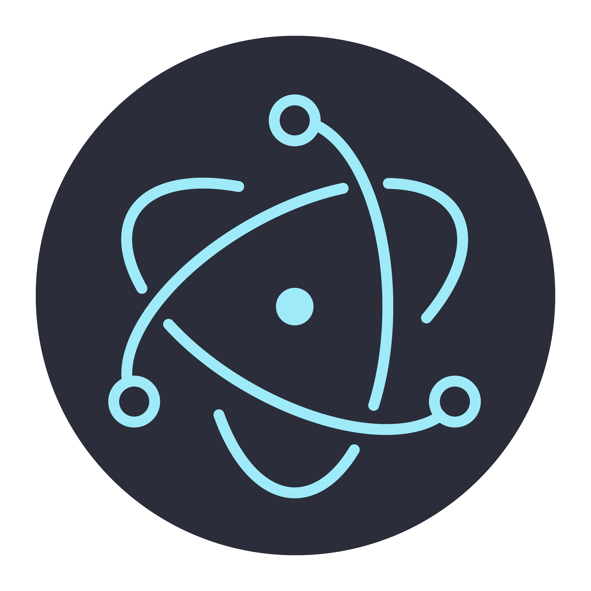

# Rotion

Rotion is an Electron Notion-like desktop application created by [@Rocketseat](https://rocketseat.com.br/) for the course Desktop Apps with Electron.



<div style="display: flex; gap: 16px">
  
  
</div>

## Screenshots

*Coming soon...*

## Stack
- [Electron](https://www.electronjs.org/);
- [Electron Vite](https://electron-vite.org/);
- [Tailwind Css](https://tailwindcss.com/);
- [Google Fonts](https://fonts.google.com/).

## Project Setup

### Install

```bash
$ npm install
```

### Development

```bash
$ npm run dev
```

### Build

```bash
# For windows
$ npm run build:win

# For macOS
$ npm run build:mac

# For Linux
$ npm run build:linux
```

## Licença

GNU GPLv3 by [Wolney Oliveira](https://github.com/wolney-fo)